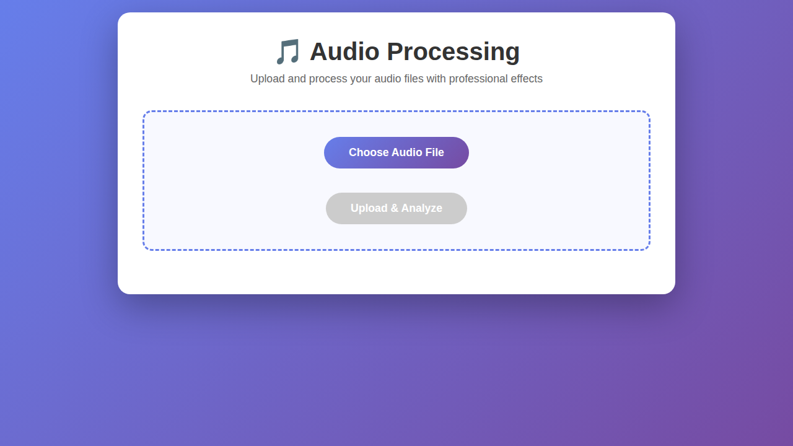
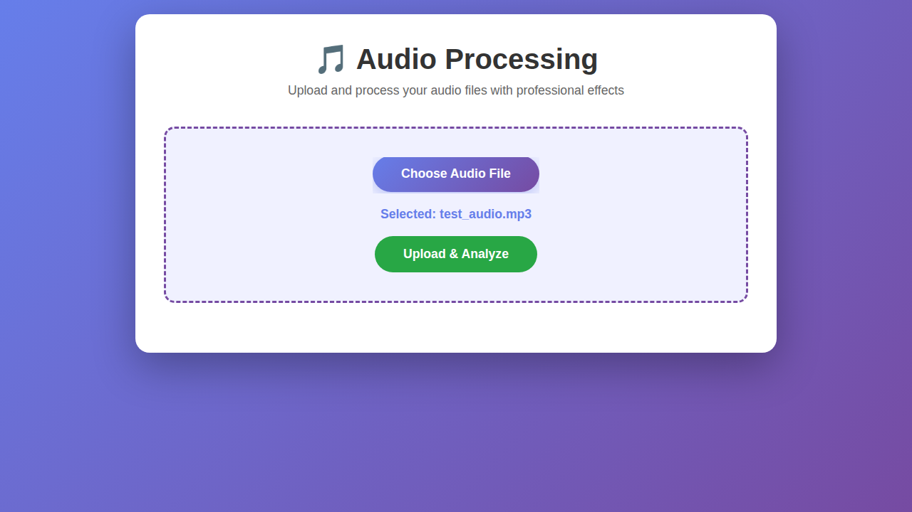
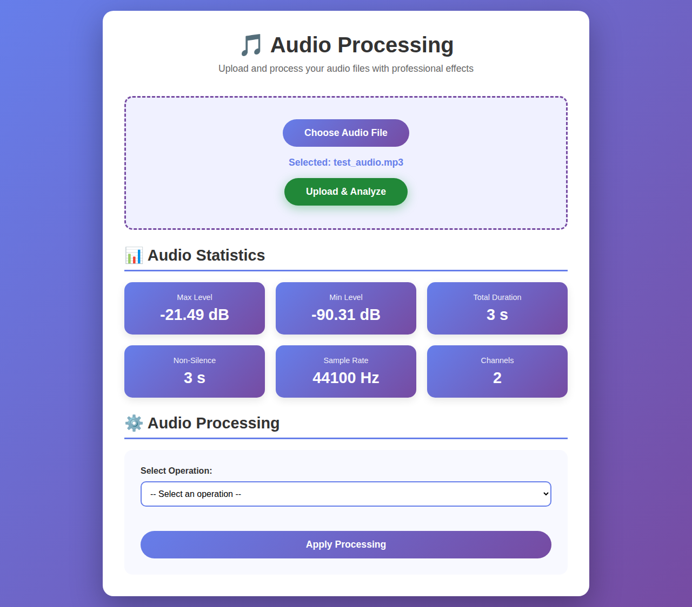
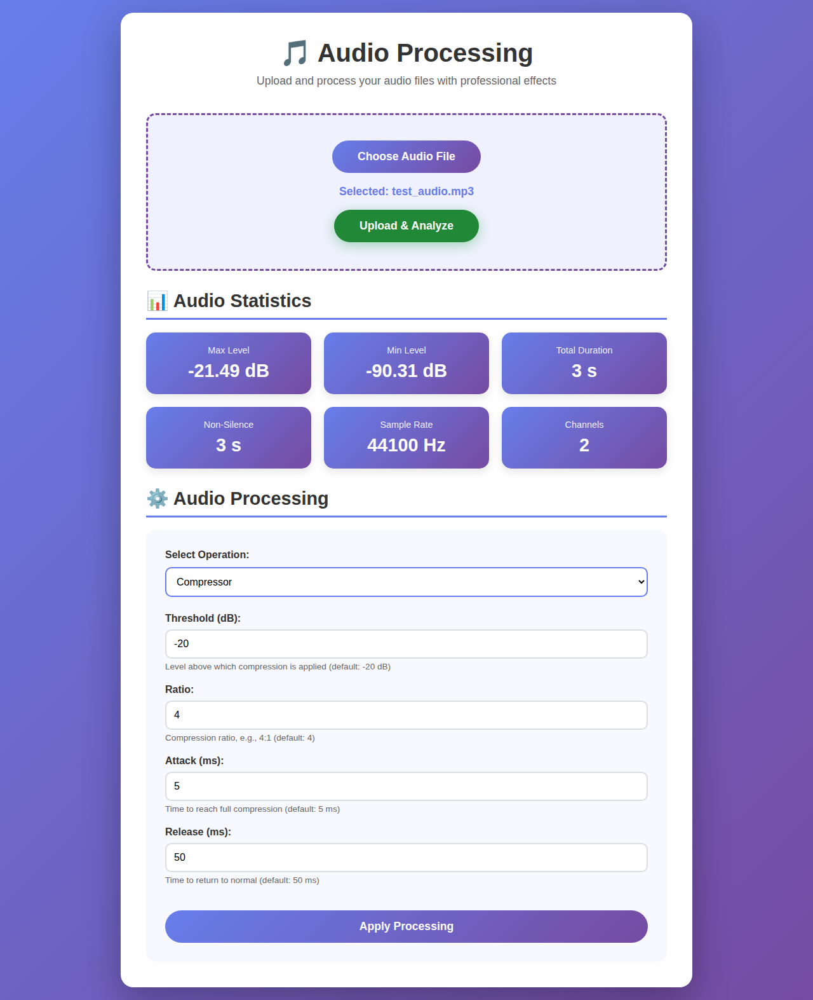
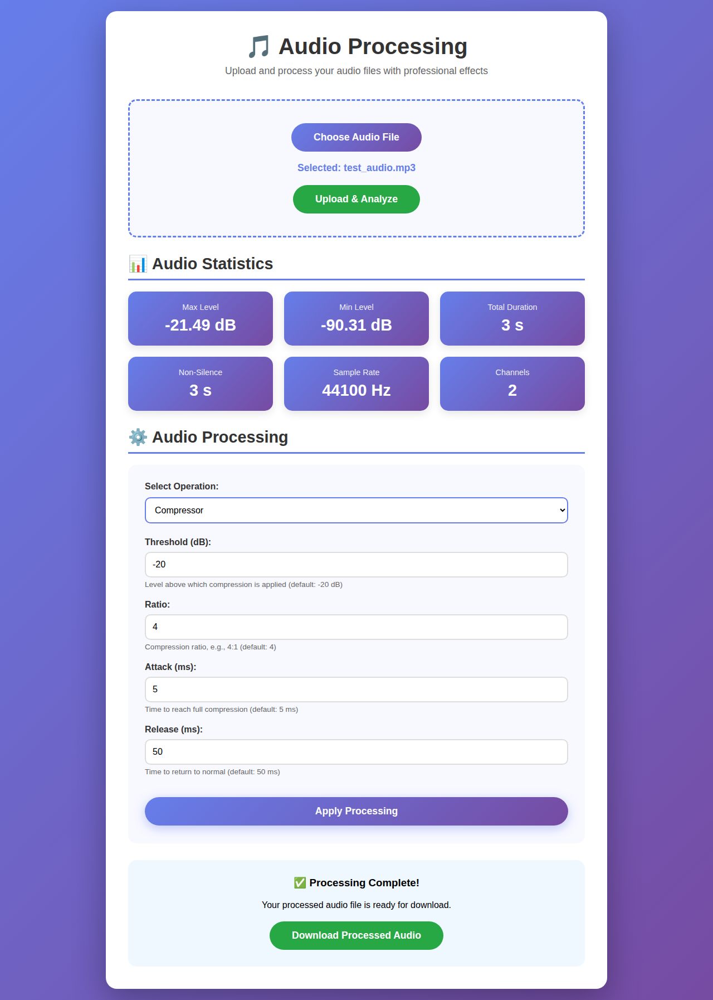
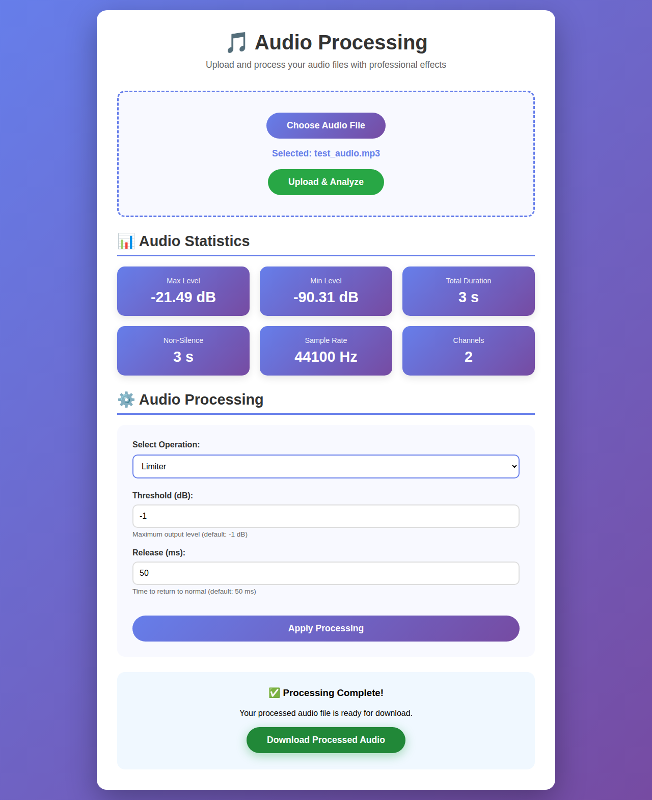

# cmps-357-audio-processing

Audio Processing Web Application - A Flask-based web application for processing and analyzing audio files.

## Features

- **Audio Upload**: Upload MP3, AAC, and AC3 audio files
- **Statistics Analysis**: Get detailed audio statistics including:
  - Maximum and minimum dB levels
  - Total recording length
  - Non-silence duration (using -50 dB threshold)
  - Sample rate and channel information
- **Audio Processing**:
  - **Compressor**: Apply dynamic range compression with customizable parameters (threshold, ratio, attack, release)
  - **Limiter**: Apply limiting to prevent clipping with customizable threshold and release
- **Download**: Download processed audio files

## Screenshots

### Upload Page

*The main upload interface with a clean, modern design*

### File Selected

*After selecting an audio file for upload*

### Audio Statistics

*Detailed audio statistics displayed after upload, including max/min dB levels, duration, sample rate, and channels*

### Compressor Parameters

*Dynamic range compressor with adjustable threshold, ratio, attack, and release parameters*

### Processing Complete

*Processing completed successfully with download button available*

### Limiter Parameters

*Audio limiter with threshold and release controls to prevent clipping*

## Installation

### Prerequisites

- Python 3.8 or higher
- FFmpeg (required by pydub for audio processing)
- Additional system libraries (Linux only)

For detailed system requirements and installation instructions for all platforms (Linux, macOS, Windows), see [INSTALL_SYSTEM_REQUIREMENTS.md](INSTALL_SYSTEM_REQUIREMENTS.md).

### Quick Start

After installing system requirements, install Python dependencies:

```bash
pip install -r requirements.txt
```

## Testing

Run the test suite:

```bash
python -m pytest test_app.py -v
```

Or simply:

```bash
python test_app.py
```

## Usage

### Running the Application

```bash
python app.py
```

The application will start on `http://localhost:5000`

**For development with debug mode:**
```bash
FLASK_DEBUG=true python app.py
```

**Note:** Debug mode should never be enabled in production environments as it allows arbitrary code execution.

### Using the Web Interface

1. Open your browser and navigate to `http://localhost:5000`
2. Click "Choose Audio File" and select an MP3, AAC, or AC3 file
3. Click "Upload & Analyze" to upload and view statistics
4. Select an operation (Compressor or Limiter)
5. Adjust parameters as needed
6. Click "Apply Processing" to process the audio
7. Click "Download Processed Audio" to save the result

### Command-Line Usage (Optional)

You can also use the AudioProcessor class directly from Python:

```bash
python example_usage.py path/to/audio.mp3
```

This will:
- Display audio statistics
- Apply compression and limiting with default parameters
- Save processed files to the temp directory

### Compressor Parameters

- **Threshold (dB)**: Level above which compression is applied (default: -20 dB)
- **Ratio**: Compression ratio, e.g., 4:1 means 4 dB input becomes 1 dB output above threshold (default: 4)
- **Attack (ms)**: Time to reach full compression after threshold is exceeded (default: 5 ms)
- **Release (ms)**: Time to return to normal after signal drops below threshold (default: 50 ms)

### Limiter Parameters

- **Threshold (dB)**: Maximum output level (default: -1 dB)
- **Release (ms)**: Time to return to normal (default: 50 ms)

## Project Structure

```
.
├── app.py                 # Flask application and routes
├── audio_processor.py     # Audio processing logic
├── requirements.txt       # Python dependencies
├── templates/
│   └── index.html        # Web interface
└── README.md             # This file
```

## Technical Details

- **Framework**: Flask 3.0.0
- **Audio Processing**: pydub (wrapper for FFmpeg)
- **Numerical Operations**: NumPy
- **File Handling**: Secure filename handling with Werkzeug
- **Silence Detection**: -50 dBFS threshold with 100ms minimum silence length

## Security Notes

- File uploads are limited to 100MB
- Only MP3, AAC, and AC3 files are accepted
- Secure filename handling prevents directory traversal
- Processed files are stored in system temp directory

## License

Examples of Processing and Editing Audio in Python
